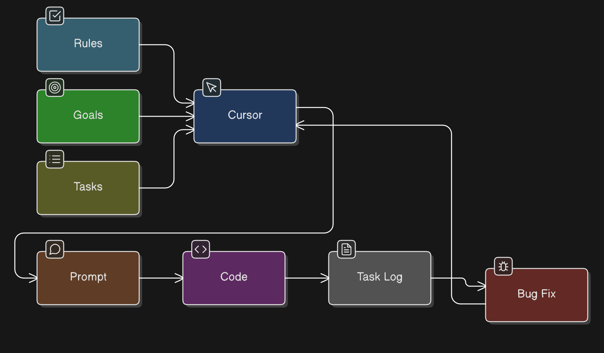

# AI-Assisted Engineering Playbook

A practical operating model for **AI-assisted software engineering** using tools such as **Cursor, Claude, and structured development workflows**.

This repository documents the workflow, rules, templates, and engineering practices I use to build complex software systems with AI while maintaining **architecture quality, security, and reliability**.

---

# Philosophy

AI should **augment engineering**, not replace it.

This playbook focuses on:

• structured development workflows  
• architecture-first thinking  
• human confirmation gates  
• reproducible engineering processes  

The goal is to enable **fast iteration without sacrificing software quality**.

---

# AI-Assisted Engineering Workflow

The workflow follows a structured loop:

Rules → Goals → Tasks → Cursor → Prompt → Code → Task Log → Bug Fix

Key ideas:

- **Rules** define architectural constraints and coding standards.
- **Goals** define the outcome we want to achieve.
- **Tasks** break goals into executable units.
- **Cursor / AI tools** assist with implementation.
- **Prompt patterns** guide the AI toward predictable results.
- **Task logs** track work performed and decisions made.
- **Bug-fix loops** close the feedback cycle.

---

# Operating Model

This workflow treats AI as a **development assistant inside a controlled system** rather than an uncontrolled generator.

Core principles:

1. Architecture decisions are **human-driven**.
2. AI output is always **reviewed and validated**.
3. All generated code passes through **engineering review standards**.
4. Workflows are **repeatable and documented**.

---

# Contents

### Documentation

- docs/01-overview.md
- docs/02-rules-and-guardrails.md
- docs/03-task-system.md
- docs/04-prompting-patterns.md
- docs/05-code-review-and-quality.md
- docs/06-debugging-and-incident-response.md
- docs/07-security-and-privacy.md
- docs/08-example-sprints.md

### Templates

Reusable templates used in AI-assisted workflows:

- templates/prompt-template.md
- templates/task-template.md
- templates/pr-review-template.md
- templates/incident-template.md

---

# Example Tools

This workflow has been used with tools such as:

• Cursor  
• Claude  
• OpenAI models  
• GitHub Copilot  
• local LLMs  

The methodology remains tool-agnostic.

---

# Who This Is For

This playbook is intended for:

- software architects
- senior engineers
- AI platform engineers
- engineering teams adopting AI tools

---

# License

MIT